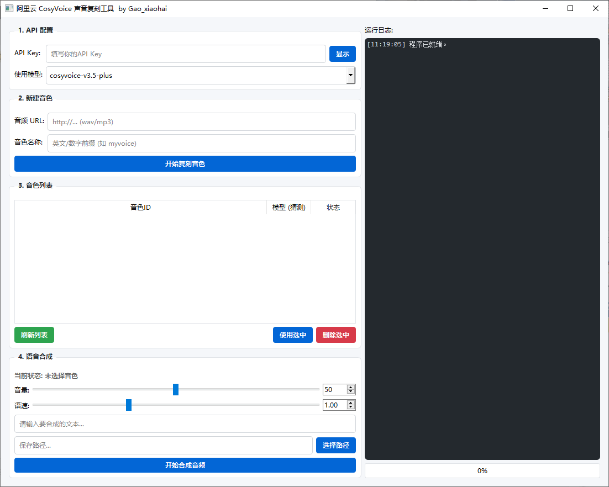

# 🎙️ AliCloud CosyVoice Tool (阿里云声音复刻工具)


## 📖 项目简介

这是一个桌面端可视化应用程序，旨在提供一个可视化界面来操作 **阿里云 CosyVoice 大模型**。

通过本工具，用户无需编写代码，即可直接调用阿里云 API 进行声音复刻（Voice Cloning）和语音合成（TTS）。界面采用了清晰的 **配置 -> 复刻 -> 管理 -> 合成** 四步工作流，并配备了实时日志显示，让 AI 语音生成变得简单直观。

## 📸 软件预览

> 

## ✨ 核心功能

根据界面划分，本工具包含以下四大模块：

### 1. ⚙️ API 配置
*   **动态 Key 管理**：直接在界面输入阿里云 `API Key`，无需修改源代码。
*   **模型选择**：支持切换不同的 CosyVoice 模型版本（如 `cosyvoice-v3-plus`）。

### 2. 🧬 新建音色 (声音复刻)
*   **URL 导入**：支持输入音频文件的 URL 地址（wav/mp3）作为复刻素材。
*   **自定义命名**：为复刻的声音设置唯一的英文/数字标识（Voice Name）。

### 3. 📋 音色列表管理
*   **可视化列表**：表格展示当前账号下的 `音色ID`、`状态` 及 `预测模型`。
*   **快捷操作**：
    *   **刷新列表**：同步云端最新数据。
    *   **使用选中**：一键加载目标音色用于合成。
    *   **删除选中**：清理不需要的音色模型。

### 4. 🔊 语音合成 (TTS)
*   **状态监控**：实时显示当前选中的音色状态。
*   **文本输入**：输入任意想要合成的文字内容。
*   **文件导出**：通过“选择路径”自定义生成的音频保存位置。
*   **实时日志**：右侧黑色控制台实时输出程序运行状态与 API 反馈，便于排错。

## 🚀 快速开始

### 1. 准备工作
*   前往 [阿里云百炼 / DashScope](https://bailian.console.aliyun.com/) 开通 CosyVoice 服务。
*   获取你的 **API Key**。
*   准备一段清晰的音频素材（建议 10秒-60秒），并获取其可访问的 URL 链接。

### 2. 运行程序

```bash
# 1. 克隆仓库
git clone https://github.com/你的用户名/你的仓库名.git

# 2. 安装依赖
pip install -r requirements.txt

# 3. 启动
python main.py
```

### 3. 使用步骤
1.  在 **"1. API 配置"** 中填入 Key，选择模型。
2.  在 **"2. 新建音色"** 中填入音频 URL 和名称，点击 **"开始复刻音色"**。
3.  观察右侧日志，等待复刻完成。
4.  在 **"3. 音色列表"** 中点击 **"刷新列表"**，选中刚才复刻的音色，点击 **"使用选中"**。
5.  在 **"4. 语音合成"** 中输入文本，选择保存路径，点击 **"开始合成音频"**。

## 🛠️ 技术栈

*   **GUI 框架**: PyQt5
*   **API 交互**: Requests / Alibaba Cloud SDK

## 📦 打包指南 (Build)

本项目支持使用 `PyInstaller` 打包为独立的可执行文件（.exe）。

1.  安装 PyInstaller：
    ```bash
    pip install pyinstaller
    ```

2.  执行打包命令：
    ```bash
    # 单文件打包模式 (推荐)
    pyinstaller -F -w main.py

    ```

3.  **产物说明**：
    *   打包完成后，可执行文件位于 `dist/` 目录下。
    *   `build/` 目录为临时构建文件，可以安全删除。

## ⚠️ 常见问题

**Q: 在 4K 屏幕上界面字体太小或模糊？**
A: 本程序已内置高分屏适配代码。如果仍有问题，请尝试在系统设置中调整缩放比例，或检查 PyQt5 版本是否为最新。

```python
# 核心适配代码
if hasattr(Qt, 'AA_EnableHighDpiScaling'):
    QApplication.setAttribute(Qt.AA_EnableHighDpiScaling, True)
```

## 🤝 贡献与反馈

欢迎提交 Issue 或 Pull Request 来完善这个项目！

1.  Fork 本仓库
2.  新建 Feat_xxx 分支
3.  提交代码
4.  新建 Pull Request

## ⚠️ 免责声明 (Disclaimer)

*   本项目仅供技术研究与个人学习使用。
*   **严禁用于电信诈骗、生成虚假新闻或任何非法用途。**
*   使用本工具复刻他人声音时，**必须**获得声音所有者的明确授权。
*   用户需自行承担因使用本工具产生的任何法律责任。

## 📄 License

MIT License

---
